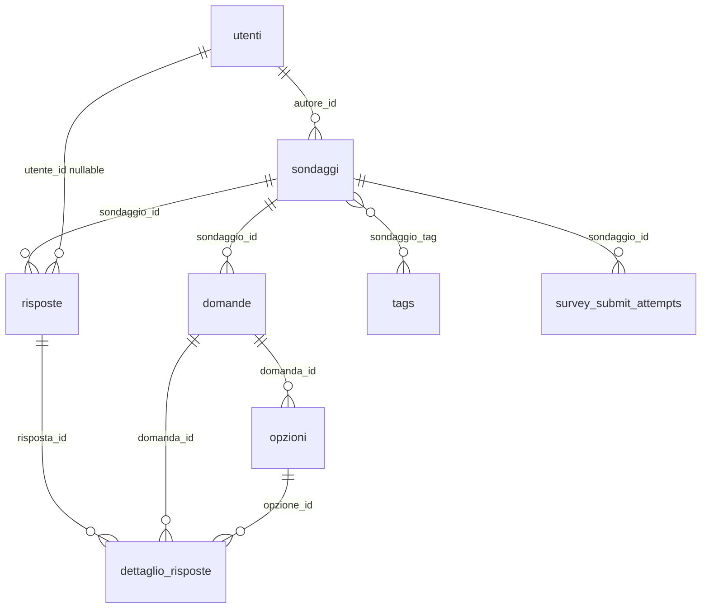

# Documentazione database — Sondaggi Sicuri

## 1. Panoramica

Il database relazionale modella **utenti**, **sondaggi** (con scadenza, pubblicazione, token, privacy), **domande** e **opzioni**, **risposte** aggregate e **dettaglio** per ogni coppia domanda/opzione scelta, oltre a **tag**, **tentativi di submit** (rate limit), **contatti** e tabelle **Laravel** (sessioni, job, cache se abilitate).

In **test** PHPUnit si usa tipicamente **SQLite in-memory** (`phpunit.xml`); in **produzione/Docker** si usa **MySQL 8**.

Le migrazioni in `database/migrations/` sono la fonte di verità dello schema (ordine cronologico dei file).

## 2. Diagramma relazionale (logico)

## 3. Tabelle dominio

### 3.1 `utenti`

| Colonna | Tipo | Note |
|---------|------|------|
| `id` | UNSIGNED INT, AI | PK |
| `nome` | VARCHAR(120) | |
| `email` | VARCHAR(190), UNIQUE | |
| `password_hash` | VARCHAR(255) | Laravel `User` usa `getAuthPassword()` |
| `remember_token` | | |
| `data_creazione` | TIMESTAMP | `CREATED_AT` del model |

### 3.2 `sondaggi`

| Colonna | Tipo | Note |
|---------|------|------|
| `id` | UNSIGNED INT, AI | PK |
| `titolo` | VARCHAR(255) | |
| `descrizione` | TEXT, nullable | |
| `autore_id` | UNSIGNED INT, FK → `utenti` | CASCADE delete |
| `is_pubblico` | BOOLEAN | default true |
| `data_creazione` | TIMESTAMP | |
| `data_scadenza` | TIMESTAMP, nullable | Aggiunta in migrazione tag |
| `access_token` | VARCHAR(64), NOT NULL UNIQUE | Valore alfanumerico 48 caratteri; route take |
| `privacy_mode` | VARCHAR(32) | Enum app: `anonymous`, `identified_hidden_answers`, `identified_full` |

**Indici**: `(autore_id, data_creazione)`.

### 3.3 `domande`

| Colonna | Tipo | Note |
|---------|------|------|
| `id` | UNSIGNED INT, AI | |
| `sondaggio_id` | UNSIGNED INT, FK | CASCADE |
| `testo` | VARCHAR(500) | |
| `tipo` | ENUM | `singola` \| `multipla` |
| `ordine` | UNSIGNED INT | |

### 3.4 `opzioni`

| Colonna | Tipo | Note |
|---------|------|------|
| `id` | UNSIGNED INT, AI | |
| `domanda_id` | UNSIGNED INT, FK | CASCADE |
| `testo` | VARCHAR(255) | |
| `ordine` | UNSIGNED INT | |

### 3.5 `risposte` (una compilazione)

| Colonna | Tipo | Note |
|---------|------|------|
| `id` | BIGINT, AI | PK |
| `utente_id` | UNSIGNED INT, nullable, FK | NULL su anonimo; UNIQUE con `sondaggio_id` se valorizzato |
| `sondaggio_id` | UNSIGNED INT, FK | CASCADE |
| `client_id` | CHAR(36), nullable | UUID cookie anonimo |
| `session_fingerprint` | CHAR(64), nullable | Hash richiesta anti-abuso |
| `ip_hash` | CHAR(64), nullable | Hash IP + salt |
| `data_compilazione` | TIMESTAMP | `CREATED_AT` model `Risposta` |

**Vincoli / indici**: `UNIQUE(sondaggio_id, utente_id)` — con `utente_id` NULL (sondaggi anonimi) MySQL consente più righe per lo stesso sondaggio; con utente valorizzato resta una sola risposta per utente. Indici su sondaggio+data, utente, sondaggio+client_id, sondaggio+fingerprint.

### 3.6 `dettaglio_risposte`

Risposte “sparse”: una riga per ogni opzione scelta (singola o multipla).

| Colonna | Tipo | Note |
|---------|------|------|
| `id` | BIGINT, AI | |
| `risposta_id` | BIGINT, FK | CASCADE |
| `domanda_id` | UNSIGNED INT, FK | CASCADE |
| `opzione_id` | UNSIGNED INT, FK | CASCADE |
| UNIQUE | `(risposta_id, domanda_id, opzione_id)` | |

### 3.7 `survey_submit_attempts`

Traccia tentativi di POST submit per **rate limiting** per `(sondaggio_id, ip_hash)` nel tempo.

### 3.8 `tags` e `sondaggio_tag`

- **`tags`**: `id`, `nome`, `slug` UNIQUE, timestamps.
- **`sondaggio_tag`**: PK composita `(sondaggio_id, tag_id)`, FK verso `sondaggi` e `tags`.

### 3.9 `contatti`

Messaggi dal form contatti: `nome`, `email`, `messaggio`, `data_invio`.

## 4. Tabelle framework (estratto)

- **`sessions`**: driver sessione database (se configurato).
- **`password_reset_tokens`**: reset password classico.
- **`cache`**, **`jobs`**, **`job_batches`**, **`failed_jobs`**: Laravel queue/cache (secondo `.env`).

## 5. Modelli Eloquent (`app/Models`)

| Model | Tabella | Relazioni principali |
|-------|---------|----------------------|
| `User` | `utenti` | `hasMany` sondaggi |
| `Sondaggio` | `sondaggi` | `belongsTo` autore; `hasMany` domande, risposte; `belongsToMany` tags; cast `privacy_mode`, date |
| `Domanda` | `domande` | `belongsTo` sondaggio; `hasMany` opzioni |
| `Opzione` | `opzioni` | `belongsTo` domanda |
| `Risposta` | `risposte` | `belongsTo` sondaggio, utente; `hasMany` dettagli; no `UPDATED_AT` |
| `DettaglioRisposta` | `dettaglio_risposte` | FK a risposta, domanda, opzione |
| `Tag` | `tags` | `belongsToMany` sondaggi |
| `SurveySubmitAttempt` | `survey_submit_attempts` | |
| `Contatto` | `contatti` | |

## 6. Logica di persistenza

1. **Creazione sondaggio**: insert `sondaggi` (token generato in `booted` se assente), domande/opzioni ordinate, sync pivot tag — in transazione (`SurveyService`).
2. **Risposta**: insert `risposte` + N insert `dettaglio_risposte` in transazione (`ResponseSubmissionService::saveResponse`).
3. **Unicità partecipazione**: identificato → controllo applicativo + UNIQUE DB su `(sondaggio_id, utente_id)`; anonimo → cookie + fingerprint + messaggio errore se duplicato.
4. **Eliminazione sondaggio**: CASCADE su domande, opzioni, risposte, dettagli, pivot, tentativi.

## 7. Seed e dati iniziali

- Migrazione **seed tag** predefiniti (`2026_04_11_000000_seed_default_survey_tags.php`): categorie iniziali per i filtri pubblici.

## 8. Manutenzione schema

- Applicare sempre **`php artisan migrate`** in ogni ambiente (Docker: servizio `migrate` prima di `web`).
- Evitare DDL duplicati fuori dalle migrazioni; eventuali script SQL in `docker/mysql/` sono documentati nel repo solo se presenti per allineamenti speciali.

Per flussi che usano questi dati lato applicazione → [documentazione-backend.md](documentazione-backend.md).
