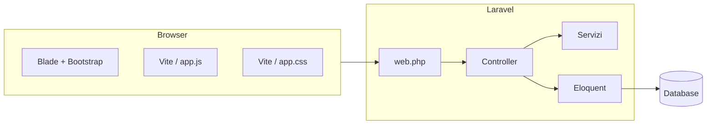

# Documentazione generale — Sondaggi Sicuri

## 1. Scopo del prodotto

**Sondaggi Sicuri** è un’applicazione web per creare sondaggi a domande chiuse (scelta singola o multipla), condividerli tramite link sicuro (token lungo), raccogliere risposte da utenti autenticati e presentare statistiche all’autore. Supporta sondaggi **pubblici** (indicizzati nell’elenco `/sondaggi`) e **privati** (solo con link), **scadenza**, **tag** e **modalità di privacy** (anonimo, identificato con o senza dettaglio risposte lato creatore).

## 2. Architettura ad alto livello

- **Monolite server-rendered**: le pagine principali sono **viste Blade**; il JavaScript arricchisce form, grafici, QR e ricerca AJAX sull’elenco pubblico.
- **Autenticazione sessione** Laravel per area riservata (dashboard, CRUD sondaggi, compilazione, statistiche).
- **Nessuna SPA**: non c’è React/Vue globalmente; lo stato dinamico lato client è gestito con DOM e `fetch` dove necessario.

## 3. Struttura repository (macro)

| Area | Path tipici |
|------|----------------|
| Logica HTTP | `app/Http/Controllers/` |
| Regole accesso | `app/Policies/` |
| Dominio e query | `app/Models/`, `app/Services/` |
| Enum / supporto | `app/Enums/`, `app/Support/` |
| Viste | `resources/views/` |
| Asset front | `resources/css/`, `resources/js/` |
| Config | `config/`, `.env` |
| Schema DB | `database/migrations/` |
| Test | `tests/Feature/`, `tests/Unit/` |
| Deploy locale | `docker-compose.yml`, `docker-compose.dev.yml`, `Dockerfile` |

## 4. Funzionalità principali

1. **Account**: registrazione, login, logout; password su tabella `utenti` (`password_hash`).
2. **Dashboard autore**: elenco sondaggi propri, link a modifica, statistiche, eliminazione; ordinamento con scaduti in fondo.
3. **Creazione / modifica sondaggio**: titolo, descrizione, pubblico/privato, scadenza, tag, privacy, domande (testo, tipo singola/multipla, opzioni). Vincoli su modifica se esistono già risposte.
4. **Condivisione**: ogni sondaggio ha `access_token` (48 caratteri alfanumerici); route `surveys.show` e `surveys.submit` lo usano al posto dell’ID numerico.
5. **Compilazione**: form con barra di avanzamento, validazione lato client e server, avviso privacy in coda al modulo; pagina di ringraziamento o errore/scaduto.
6. **Sondaggi pubblici**: `/sondaggi` con ricerca, filtri tag, paginazione; ricerca live via JSON; sondaggi già compilati dall’utente ordinati in coda e card visivamente “disattivate”.
7. **Statistiche**: pagina autore con aggregati, partecipanti (secondo privacy), export **PDF** (DomPDF).
8. **Contatti**: modulo messaggi persistito in `contatti`.
9. **Sicurezza operativa**: rate limit tentativi di submit per IP (hash), cookie UUID per anti-duplicato su sondaggi anonimi, redirect sicuri post-login.

## 5. Flussi end-to-end

### 5.1 Autore crea un sondaggio

1. Login → `dashboard` → “Nuovo sondaggio”.
2. `POST surveys.store` → `SurveyService::create` persiste `sondaggi`, `domande`, `opzioni`, pivot tag.
3. Redirect alla dashboard; da lì link a modifica, statistiche, compilazione (token).

### 5.2 Partecipante compila

1. Utente autenticato apre `GET /sondaggi/{token}` (`surveys.show`).
2. Se scaduto: vista “chiuso”; altrimenti form `POST surveys.submit`.
3. `ResponseSubmissionService` valida, applica rate limit, privacy (anonimo vs identificato), salva `risposte` + `dettaglio_risposte`.
4. Risposta: vista “grazie” (eventuale cookie su anonimo) oppure errori sulla take.

### 5.3 Visitatore elenco pubblico

1. `GET /sondaggi` (anche non loggato): elenco sondaggi pubblici non scaduti.
2. Opzionale: filtri e `GET /sondaggi/ricerca` JSON per aggiornare card e paginazione senza ricaricare la pagina.

## 6. Ambiente di esecuzione

- **Locale**: PHP + Composer, `npm run dev` / `build` per Vite; oppure Docker Compose (`migrate` one-shot, servizio `web`, DB MySQL, opzionale `worker` con profilo `queue`).
- **Health**: route Laravel `GET /up` (usata anche dall’healthcheck Docker).

## 7. Collegamenti alla documentazione dettagliata

- **Frontend**: struttura asset, Blade, componenti visivi → [documentazione-frontend.md](documentazione-frontend.md).
- **Backend**: controller, servizi, auth, endpoint JSON → [documentazione-backend.md](documentazione-backend.md).
- **Database**: tabelle e relazioni → [documentazione-database.md](documentazione-database.md).

## 8. Convenzioni e naming

- Nome applicazione configurabile con `APP_NAME` (es. “Sondaggi Sicuri” in produzione).
- Tabelle italiane nel dominio: `sondaggi`, `domande`, `opzioni`, `risposte`, `utenti`, ecc.; il model Eloquent `User` mappa comunque `utenti`.
